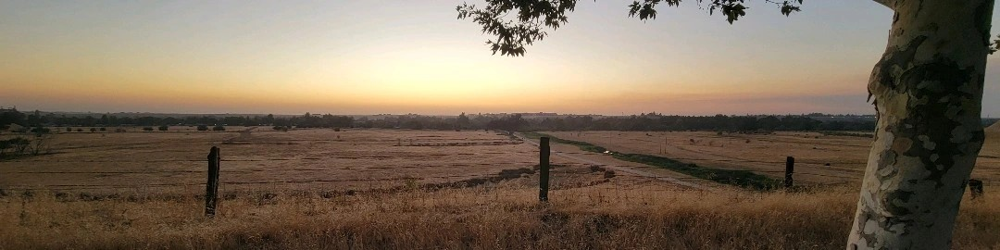

### In the name of Allah, the Gracious, the Merciful

<!-- Banner Image -->

# Abdullah Tarakji (عبدالله طراقجي)
### Syrian-American high school student, planning to enroll in university for electrical engineering, In Sha Allah

---

## 🛠️ Skills

### 💻 Languages  

### 🧰 Software & Tools

#### Biliginual (English/Arabic)

#### Electronic Circuit Design (including usage of KiCad and Ardunio)

#### Electronic repair and troubleshooting

---

### GitHub Stats

